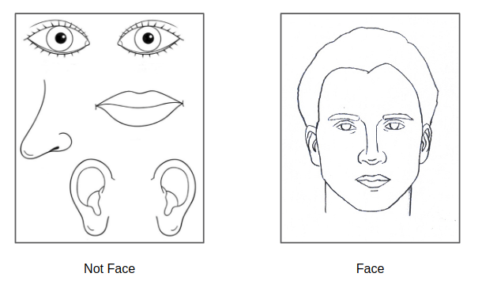
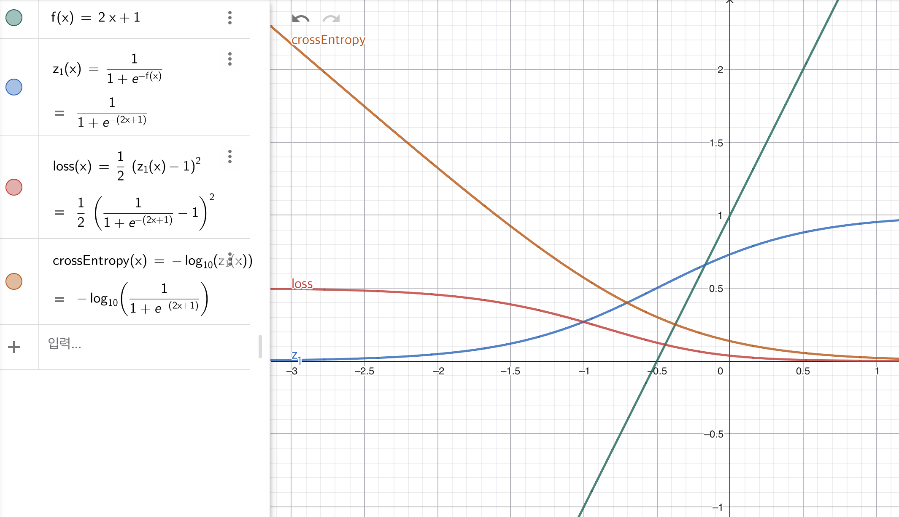
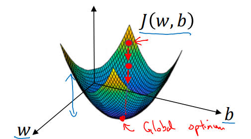

# Introduce

NN의 전반적인 수학적 지식 및 logistic regression simple classifier model에 대한 설명입니다.

## what is neural network?

가장 기본적인 형태의 neuron 형태이다. 왼쪽에서부터 오른쪽으로 implement되어 흘러간다, 흔히 $x$라고 부르는 input이 연산을 거치고 $y$ 라는 output으로 나오게 되는데, 이때의 연산을 담당하는 부분으로 node로 표시하며, neuron이라고 명칭한다.

$$
input \rightarrow node \rightarrow outputs
$$

### housing price prediction

가장 기본적인 문제중 하나인 집값 예측이다. 집값을 유추할 때, 여러가지 요소들이 작용할 것이다. size, bedrooms, postal code, wealth... 여러가지가 존재할텐데, 이들이 복합적으로 엮여 price라는 값을 이룬다.

따라서 이들을 각각 feature로 생각을 하며, 이를 통해 estimated해야 하는 predict값을 y라고 명칭할 수 있다.

예를 들어 위의 4가지 feature와 price를 예측하기 위해, 흔히 node를 한줄로 구성하는 layer라는 것을 2개 넣어보자. 이는 hidden layer라고 부르며, 각 hidden layer내 각 node는 연결된 feature을 토대로 값을 estimated한다. 이는 스스로 figure out 하여, price에 도움이 되는 값을 내보낸다.

hidden"이라는 이름은 학습 데이터에 이 layer의 정답 값이 없다는 뜻이다. 우리가 모델에 주는 것은 input feature $x$와 정답 $y$뿐이고, hidden layer의 node가 어떤 값을 가져야 하는지는 알려주지 않는다. 이 값은 모델이 $\hat{y}$를 $y$에 가깝게 만드는 과정에서 스스로 학습하며, 우리는 weight 학습을 통해 간접적으로만 영향을 줄 수 있다

만약 hidden layer을 densly connected layer로 구성하게 된다면, 위의 input feature을 제공했을 때, first hidden layer는 4개의 inputs을 받을 것이다.

어쨋든 우리의 목표는 data X and Y를 받아, X 에서 Y로 가는 accurately map을 implement하는 것이다.

## supervised learning with nn

이 방식에서의 최종목표는 input(x)를 통해 to learn a function to output(y)이다. 따라서 여러 가지 Application을 이용하여, X와 Y를 설정함으로써 particular problem을 해소하면서 문제를 정의하고 해결한다.

supervised learning에서는 총 2가지 종류의 데이터를 볼 수 있는데, 각각 structured data / unstructured data이다. structured data는 feature들이 very-well defined meaning되어 있다는 것이다. 그럼으로 써, 학습을 하기에 어려움이 없지만 unstructured data는 그렇지 않으며, interpreting이 어렵다는 특징이 있다. 따라서 sense에 따라 unstructured data를 structure화 하는 것이 중요하다.

## why Deep learning?

역사적으로 그리고, data의 양에 따라 deep learning이 주목받게 된 이유를 서술하겠다.

### scale drives deep learning progress

머리속에 amount of data (x axis) - performance (y axis)를 그리면서 읽어보면 좋다.

#### 1. Traditional learning algorithm

고전적 알고리즘이다. 이러한 알고리즘의 방식은 일정 data size이상의 학습을 할 수 있는 역량이 안되어, performance를 기대할 수 없다. 기존까지는 상관없었지만, digital device의 발달 등으로 인해 data의 양이 기하급수적으로 증가하였으며, 우리가 model에게 원하는 performance도 같이 증가하게 되었다. 따라서 traditional algorithm의 방식으로 만든 model에는 한계가 있다.

#### 2. small, medium nn

nn로 구성한 algorithm의 크기에 따라 small과 medium으로 나누었는데, nn model을 scale별로 구별한 데에는, amount of data에 따른 performance가 scale에 비례하기 때문이다. hit high-level performance를 구현하기 위해서는 아래 2가지가 필요하다.

1. to be able to train Large NN in order to take advantage of a huge data
2. need a lots of data

따라서, high-level performance를 추구하다 보니, scale up을 자연스레 요구하게 되었다. 물론 scale up을 하며, 데이터가 부족하거나 train이 오래 걸린다는 단점이 있지만, 이를 감안하더라도 scale up은 필요하다.

#### 3. large nn

우리가 지향해야 하는 방향성이며, 가장 high-level performance를 표현할 수 있는 algorithm이다. 만약 large NN으로 small train set을 학습시킨다고 가정해보자. 기존 traditional algorithm은 잘 학습을 할 것이다. 하지만 large NN에서는 데이터의 양이 부족하여, 제대로 학습 못할 수 있다. 따라서 이럴때는 여러가지 skill을 사용하여, performance를 올린다. 물론 huge data 상황에서는 dominating other approachs 해버린다.

#### cycle

model의 개념을 3가지로 나눠보자면,

1. Data
2. Computation
3. Algorithm

이렇게 생각할 수 있다. 그래서 cycle을 형성하는데, 아래의 것들을 반복한다.

$$
Idea \rightarrow Code \rightarrow Experiment
$$

이때 인간에게 생기는 병목은 Code를 통해 Experiment를 구하는 Computation 부분이다. 따라서, 인간은 Computation을 더 빠르게 하기 위해, hardware 성능을 높히거나, 연산 방법인 algorithm을 업그레이드 시킨다. 우리가 현재 가장 쉽게 도전할 수 있는 분야는 algorithm을 업그레이드 하는 것이며, 이것이 problem solving에 선두주자로 달려가야 한다.

대표적으로 sigmoid를 ReLU으로 대체하는 것이 있다. 기존 sigmoid는 지수함수를 기반으로 구성되어 있다.

$$
sigmoid = \frac{1}{1 + \exp^{-x}}
$$

하지만 ReLU는 선형함수이며, 연산의 속도가 빠르므로, 이를 사용함으로써, computation의 발전을 이루었다

</br>
</br>

# Geoffrey Hinton Interview

Andrew Ng과 Geoffery Hinton의 인터뷰에서 insight를 찾고자, 정리를 해본다.

## backpropagation

개발자 Sutherland는 sementic net이라는 개념의 의미를 다른 개념과의 연결로 정의하는 형태를 연구 하였었다. 이는 embedding의 시초로써, 개념들과의 연결로 문장의 문맥을 나타내었다. 사고를 구조역학적으로 나타낸 것이다. 추후 나중 임베딩은 latent space에 사고를 벡터로 나타내어, 문장의 문맥들의 벡터를 합하면, 그 하나의 큰 벡터가 문장의 뜻을 나타내는 방식으로 발전하였다.

어쨋든 이러한 배경속에서, sementic net을 학습시키기 위해, backpropagation을 사용하였는데, 이를 통해 변환을 찾고, 최종목표는 untrained data에 대해 성공적으로 predict하는 것이 목표였다.

## nn and brain

aima에서의 지식을 인용하자면, neoron network는 신경학적으로 인간의 뇌의 soma를 모방하는 형태라고도 해석할 수 있다. 여기서도 마찬가지로 nn을 brain과 비슷하다고 생각을 했다. 기존에 backpropagation이 나왔지만, 뇌에서는 이러한 현상이 없어, 회의적인 시각이 있었다고 했다. 하지만 학습을 하기 위해서는 input에 대한 grads를 구해야 하며, 이런 algorithm이 진화적으로 인간 뇌에서 안 일어날 수 없다고 hinton은 말했다 (강단이 있으시다). 그래서 우리가 알 수 없는 형태이지만, 뇌에서도 이러한 backpropagation이 일어날 것이라고 생각을 했고, nn의 hidden representation을 learning하는 것이 마치 brain의 synapse와 비슷하다고 생각했다. propagation이 forward/backward을 가지는 것처럼 brain또한 wake/sleep의 mode가 있다고 설명했다.

## bound to train

또 hinton은 bound라는 단어를 사용했는데, 한국어로 하한선이라고 생각하면 편할 것 같다. 우리가 모델을 학습시키는데, bayes error을 가지는 performance를 목표로 학습시키는 것에 집중한다. 하지만 반대로, 모델의 performance가 어느 수준 아래로 떨어지지 않도록 하는 것도 중요하다.

그래서 hinton은 learning layer가 추가된다면 (간단하게 $w^{(i)}$에서 $w^{(i+1)}$ layer를 추가한다 생각하면 된다.), $w^{(i+1)}$ layer는 $w^{(i)}$의 하한점에서 올라가므로, 무조건 성능 향상 폭이 0 또는 그 이상이라는 것이다. 따라서 **variational bound**라고 생각하면 될 것 같다.

variational이란 변분법으로, optimization을 할때, 숫자가 아닌 함수를 변경하는 방법이다.

EM compute에 대해서도 다뤘는데, VAE 지식을 쌓고 다시 찾아봐야지 영감을 얻을 수 있을 것 같다.

## recirculation algorithm

hinton은 backpropagation없이, 모델을 학습시킬 수 있는 방법에 대해 고안하기도 하였다. 그래서 나온 방법이 forward을 2번 사용하여, 그 결과 값의 오차를 사용한 것인데, 시간의 차이를 통해 오차를 구한 것이다. 다만 hinton의 recirculation은 `(odd - new)`형식의 연산이므로, new $\rightarrow$ odd 형식이다. 하지만 추후 나온 STDP(spike timing dependent plasticity)은 odd $\rightarrow$ new 형태으로 발표하였다.

## multiple time scales

기존의 algorithm은 재귀호출시, 상위호출이 사용한 변수들을 메모리에 저장해두었다가, 하위호출이 종료되면, 콜스택 과 같이 다시 불러왔었다. 하지만 nn구조에서는 weight를 서로 공유하기 때문에 이를 구현할 수 없었는데, hiton은 short-term memory라는 개념으로 adapt,decay,fast weight를 사용하여 해결할려고 했다.

## capsules network

hinton이 인터뷰 당시 현행 연구중인 주제이다. 현재 each neuron은 simple scalar value을 representation한다. 이는 cnn을 예시로 이해하기 편하다.


위와 같이 사람 얼굴이 있다고 해보자. cnn에도 kernel의 localy를 저장할 수 있어, 충분한 학습이 된다면, 위와 같이 구별해 낼 것이다. 하지만 "충분한" 학습이 오래 걸린다는 점을 capsule net에서는 지적을 하였다. 기존 cnn은 neuron이 entity만을 single scalar 값으로 표현하고 있다. 하지만 우리가 사물을 인식할 때에는 property(속성)도 파악을 해야한다. 왼쪽 얼굴은 entity는 모두 있지만, 정상적인 property를 가지지는 않은 모습이다. 또다른 예시로 뒤집힌 돛단배, 불타고 있는 얼음 등등이 있을 것이다.

그래서 capsule net은 하나의 entity를 인식하는 nn을 capsule과 같이 묶어 버렸다. 그래서, entity를 나타내는 하나하나의 property representation vector을 묶은 후, 이미지 등을 인식하는 것이다.

그래서 이렇게 구성한 후, Dynamic Routing대로, 신호에 따라, 가장 적합한 entity+property를 골라 처리하는 것이다.

# Neural Networks using python

## binary classification

binary 분류는 이진분류로써, input의 데이터를 사용하여 predict값인 y값을 0 또는 1로 출력을 하여, True/False로 문제를 분류하는 방법이다. 따라서 여러가지 input data를 우리가 학습시킬 수 있는 상태인 feature vector으로 unroll하여 preprocessing하는 것이 중요하다.

### natation

$$
x \in \R^n, y \in {0,1} 일때, f(x) = f([x_1,x_2,...,x_n]) = \hat{y} \approx y
$$

위의 식과 같이 표현할 수 있다. model을 통해 나오는 output값은 0부터 1사이의 실수 값이며, 이를 최대한 근사하게, 0 또는 1의 값을 가지는 y값에 가까히 예측하면 되는 것이다.

위의 식은 x라는 n개의 feature vector를 한번만 학습시키는 식이며, m번 학습을 반복한다고 하면, 아래와 같이 표현할 수 있다. `x.shape = (n,m)`이다.

$$
x = [[x_{11},x_{12},...,x_{1n}],[x_{21},x_{12},...,x_{2n}],...,[x_{m1},x_{m2},...,x_{mn}]], x_{ij} \in \R^{mn}
$$

$$
y \in \R^{m}
$$

## Logistic Regression

로지스틱 회귀는 binary classification에서 사용하는 training algorithm이다.
함수식으로는 linear regression을 sigmoid로 wrapping한 형태이다. wrapping의 이유는, linear에 input feature vector에 따라 $\hat{y}$의 값이 0부터 1의 값이 아닐 수도 있다는 것이다. 그래서, 어떠한 input을 받더라도 0부터 1의 값만을 출력하기 위해 sigmoid를 사용한다.

$$
\hat{y} = A = \sigma(Z) = \sigma(wX + b)
$$

이때 X는 위에서 말했던 n dimention feature vector인데, w와 b는 각각, weight, bias를 뜻하며 각각의 차원은 다음과 같다.

$$
w \in \R^n, b \in \R (scalar\ value).
$$

가끔 w와 b를 하나의 $\theta$ vector로 표현을 하기도 한다. $\theta_0 = bias$로 취급하면 된다.

### loss, cost function

그래서, 학습에 필요한 loss(label - target의 오차)를 위의 식을 사용하여 나타낼 수 있다. 따라서 학습 한번에 의하여 생긴 오차는 loss function으로 표현하며, 학습 데이터들 m번 반복으로 생긴 오차들의 평균은 cost function으로 표현한다.

$$
L(X) = -logP(\hat{y}|x) = -log(y^{log\hat{y}}(1-y)^{log(1-\hat{y})}) = -ylog\hat{y} - (1-y)log(1-\hat{y})
$$

이때 $P(\hat{y} | x)$라는 표현의 뜻은 무엇일까? 우리가 왜 lossfunction을 위와 같이 정의했는지를 이해하기 위해서는 -log을 취하기 전의 독립항등분포(identically independently distributed, IID)에 대해 이해를 해야한다. 우리가 x training set에 대한 label들의 확률들은 각각이 독립적 시행이며, 같은 모델을 공유하고 있기 때문에 분포가 동일하다. 따라서 아래와 같이 나타낼 수 있다.

$$
p(label\ in\ feature\ vector) = \Pi_{i = 0}^{m} P(\hat{y}^{i} | x^i)
$$

이때 우리는 input인 feature vector을 변경하지 않고 이 iid 값을 최대로 올려야 한다. 하지만 m개의 x가 같은 weight와 bias를 공유하고 있으므로, 우리는 최대 우도 추정(maximum likehood estimated)를 따라야 한다. 이때 우도란? input과 output인 x와 y를 변경하지 않고, maximum estimated를 하는 것으로, w와 b를 gradient descent기법으로 학습을 하며, 수정하는 것이다. 쉽게 말해 데이터는 고정하며, 함수를 바꾸면서 최대값을 추정하는 것이다.

우리가 이렇게 최대우도추정 및 독립항등분포는 모델링과정에서의 가정이며, 실제 문제에서는 이에 대한 가정이 깨지기도 한다.

1. 시계열 데이터 : 독립적이라는 가정이 깨지게 되면서, 해결법은 종속적인 시계열 값인 time에 대해 그룹화 하여, 데이터셋을 분리하는 것이다.

2. 그룹데이터 : 그룹 내 데이터는 그룹에 종속적이게 되며 독립적이라는 가정이 깨지게 된다. 이는 각 그룹별로 데이터를 분석하면 된다.

3. 학습데이터와 테스트데이터 불일치 : 학습데이터와 실제 테스트 데이터의 분포가 동일하다는 가정이 깨지게 되며, 이는 학습에 대한 의미가 불안정해질 수 있다. 따라서, 실제 데이터를 변환할 수는 없으니, 학습데이터를 실제 데이터에 걸맞게 변환하여야 한다.

추가로 그러면 왜 IID값에 "log" 함수를 취해줬을까? 여러가지 loss function들 중에 대표적으로 MSE(mean square error)라는 함수가 있다. 이 함수는 아래와 같다.

$$
MSE = \frac{1}{2}(\hat{y} - y)^2
$$

위와 같이 다항함수 꼴이다. 이는 sigmoid 함수를 이차함수꼴에 넣으면 non-convex가 되기 때문에다. 함수 그래프로는 아래와 같다.



빨간색 loss function을 봐보면, convex형태가 아니므로, global optimum으로 근사될 수 없을 수 있다. 따라서 -log를 취해, 지수형태인 sigmoid 형태를 풀어줌으로써, convex형태를 표현하여 loss function으로 사용한다, 이를 통해 gradient descent 를 통해 최적의 해로 도달한다. 그리고 -log을 취함으로써, asent가 아닌 descent를 수식적으로 확립시켜주는 것도 좋은 점이다.

서사가 길었지만! 어쨋든 cost function은 아래와 같다.

$$
J(w,b) = -\frac{1}{m} \Sigma[ylog(\hat{y}) + (1-y)log(1-\hat{y})]
$$

### Gradient Descent



위에서 정의한 cost function을 생각해보자. 마치 bowl 형태로 convex한데, 빨간 점을 init point라고 생각해보자. 과연 init point가 convex function에서는 중요할까?

우리가 derivative을 정의할때, slope를 구한다고 말한다. 기울기는 $\frac{height}{width}$인데, 만약 기울기의 각도가 0~90라면, 양수의 기울기를 가진다고 말한다. 하지만 우리가 위에서 loss function을 취할때, 그리고 slope에 대한 grad를 표현할때 -log을 취한 것처럼, grads(slope)에 따라 모델의 weight를 optimization 할때도, learning rate(그래프에서는 step size)만큼의 변화량만큼 원래의 값에서 -값을 더해준다.

이로써, 자동적으로 기울기가 양수면 감소, 음수면 증가가 되면서 자동스레 극댓값이 0인, 평평한 곳을 방향으로 향하게 된다. 아래는 optimization 함수 중 SGD 함수이다.

$$
\theta = \theta - \alpha \frac{\partial J(w)}{\partial w}
$$

따라서 init point가 달라지면 training 시간이 달라져도, convex function에서는 global optimum으로의 수렴여부는 고민 안해도 된다.

## backpropagation

위의 식중에 $\frac{\partial J(w)}{\partial w}$ 부분을 봐보자. 이 식을 해석하면 w에 따른 J(w)의 변화량이라는 것이다. 그렇다는 것은, w의 변화량이 얼마나 J(w)에 영향을 끼치는 영향도라고도 해석할 수 있다. v라는 값을 미세하게 변화했을 때의 J의 변화량이라고 생각을 하면, feature vector의 각 input 값이 각각 얼마나 cost function J(w,b)에 영향을 끼치는지 파악을 하고, 이에 따라 MLE의 기법으로 x가 아닌 w,b를 수정하여 optimization을 한다는 것이다.

### chain rule

위의 geogebra에 사용했던 함수를 예시로 사용하겠다. chain rule은 간단하게, 합성함수들에 따른, 변화량을 보다 쉽게 구할 수 있는 기법으로 생각하면 좋을 듯 하다.

$$
\frac{\partial J(w)}{\partial w} = \frac{\partial J(w)}{\partial A(w)} \frac{\partial A(w)}{\partial Z(w)}\frac{\partial Z(w)}{\partial w}
$$

이렇게 나타낼 수 있다. 따라서 각 합성함수들의 곱 형태로 나타내어, 보다 쉽게 값을 구할 수 있다.

따라서 logistic regression에서의 derivative를 구해보면 아래와 같다.

$$
\frac{\partial(J(\theta))}{\partial\theta} = -(\frac{y}{\theta} + \frac{(1-y)}{1-\theta})
$$

$$
\frac{\partial(A(\theta))}{\partial\theta} = \frac{\exp^{-\theta}}{(1+\exp^{-\theta})^2} = \frac{1}{(1+\exp^{-\theta})}(1-\frac{1}{(1+\exp^{-\theta})}) = A(\theta)(1-A(\theta))
$$

$$
\frac{\partial(J(\theta))}{\partial(A(\theta))} \frac{\partial(A(\theta))}{\partial\theta} = A(\theta) - y
$$

따라서 위와 같이 python에서 코드구현을 하였다.

```py
dw = (1/m) * np.dot(X, (A - Y).T)
db = (1/m) * np.sum((A - Y).T)
```

이때 dw, db를 누적변수(accumulator)라고 표현할 수 있는데, 이는 가중치 변화량의 값이 계속 더해지는 이유이다. 매번 초기화 하지 않는 이유는 여러번 학습에서 변화를 한다는 것에 의미를 갖기 위해서이다.

## Vectorization

기존 for loop를 사용하여 logistic regression propagation을 implement하면, 연산의 처리량 및 시간이 많이 소요된다. 따라서, vectorization을 사용하여, 연산으로부터의 우위를 가져갈 수 있다. 하지만 numpy.dot 연산을 찾아보니, 시간 복잡도는 $O(n^3)$으로 동일(n epoch 실행한다 가정)하지만 하드웨어적으로 최적화를 한 것이니, 행렬 연산을 한번에 처리한다라는 표현은 알맞지 않은 것 같긴 하다.

### broadcasting

numpy 연산을 하다보면, 행렬의 크기가 맞지 않음에도 불구하고, 아래 연산들을 에러 없이 실행 할 수 있다.

1. numpy.dot
2. numpy.multiply
3. numpy.outer

이는 python의 boradcasting 덕분이며, 연산시 필요한 차원을 copy를 통해 size면에서 flexible하게 도와주는 기능을 담당하고 있다. 하지만 too much한 flexible로 인해, 에러가 나지 않는 원하지 않은 값을 연산하게 되는 경우가 발생한다. 따라서 다음들을 조심해야 한다.

1. `np.random.rand(5)` : 이 코드는 1차원으로 5개의 요소를 랜덤으로 갖는 numpy행렬을 만들어주는 것인데, 이때 `shape = (5,)`의 형태로 배열도 튜플도 아닌 상태로 된다. 따라서 이러한 경우에는 `np.random.rand((5,1))`을 통해 차원을 명시적으로 표현하자.

2. reshape는 말 그대로 모양을 바꾸며, 보통 unroll을 시행할때, 사용하는데 아래와 같이, 남길 차원을 정의하고, 연산을 자동으로 할 수 있다. `np.reshape(-1,1)`

3. normalization vector을 시행할때, 보통 vector의 크기를 각 요소에 나눠준다. 따라서 위의 broadcasting을 이용하여, $x = \frac{x}{||x||}$로 손쉽게 표현할 수 있다. 또는 `np.linalg.norm(x, ord=None, axis=1)` 을 통해서도 표현할 수 있는데, default norm은 Frobenius Norm이며, 1과 2는 각각 L1,L2norm인 manhatten,euclidian norm이다.

# Model

logistic classifier architecture에 대해서 간단하게 설명하겠다.

1. input x is feature vector ($x \in \R^n$)
2. w,b is initalized to zero (or some scalar)
3. $z$ is computated by perceptron $z = w^T X + b$
4. $A$ is sigmoid to linear regression (z). $A = \sigma(z) = \frac{1}{1 + \exp^{w^T X + b}}$
5. $J$ is cost function to mean loss functions. $J = -\frac{1}{m}\Sigma ylog(1-A) + (1-y)log(A)$
6. using backpropagation, calculated dw, db

```py
dw = (-1/m) * np.dot(X, (A-Y).T)
db = (-1/m) * np.sum((A-Y).T)
```

7. return to grads, optimization

```py
w -= learning_rate * dw
b -= learning_rate * db
```

8. predict (not use grads, costs, ...)

```py
A(x) = Y(predict)
```

## some tips

preprocessing을 한 부분이 있는데, 바로 pixel 값을 0~1의 값으로 변경해준 것이다. 이를 통해 propagation에서 보다 더 안정적으로 학습이 가능했다.
